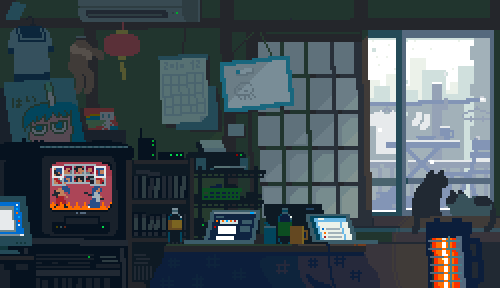

<h1 align="center">
  
</h1>

  

---

## 🚀 About Me

Currently working at E-Mech Solutions as a Software Engineer.
Having hands-on experience in agentic AI systems, RAG pipelines, and LLM-powered applications. Skilled
in building multi-step agent workflows using LangGraph and LangChain, retrieval-optimized knowledge bases with vector
databases, and backend services using FastAPI. Eager to apply GenAI engineering skills to design and deploy AI-driven
workflows for real-world problem-solving.

---

## 🛠️ Tech Stack

**Languages:**  

**AI / ML:**  

**GenAI Frameworks:**  

**Backend:**  

**Databases & Vector Stores:**  

**Libraries:**  

**DevOps & Tools:**  

**Cloud & Deployment:**  

---

### 🧠 Core Concepts
`Agentic AI` `Multi-Agent Systems` `RAG` `Tool Calling` `LLM Orchestration`  
`Vector Databases` `Prompt Engineering`

---

## 💼 Projects

### 🔹 [CodeSentinel — Multi-Agent Code Analysis & Self-Repair System ](https://github.com/ritwik-basak/CodeSentinel) &nbsp;  
**autonomously reviews GitHub repositories and self-repairs bugs**
LangGraph orchestration · RAG via Pinecone + LlamaIndex · E2B sandbox execution · Tree-sitter AST parsing · Real-time SSE streaming · React + Vite frontend

`LangGraph` `LlamaIndex` `Pinecone` `Groq Llama 3.3` `E2B` `Tree-sitter` `FastAPI` `React`

---

### 🔹 [Flowdesk — Agentic Customer Support System](https://github.com/ritwik-basak/flowdesk-support-agent) &nbsp; 
**production-grade multi-agent system for intelligent customer support automation**
LangGraph supervisor architecture · Hybrid RAG (Pinecone + BM25 + CrossEncoder) · LLMOps evaluation & confidence scoring · PostgreSQL-based memory · Dockerized deployment on GCP Cloud Run · CI/CD with GitHub Actions

`LangGraph` `LangChain` `Pinecone` `BM25` `CrossEncoder` `PostgreSQL` `Gemini` `Groq` `FastAPI` `Docker` `GCP`

---

### 🔹 [Minerva — Agentic Research Intelligence](https://github.com/ritwik-basak/Minerva)
**Multi-agent research platform with structured report generation**  
Supervisor → Search → Reranker → Summarizer → Writer pipeline · Gemini 2.5 Flash · LangSmith tracing · Tavily search · CrossEncoder reranking

`LangGraph` `Gemini 2.5 Flash` `Tavily` `CrossEncoder` `LangSmith` `FastAPI SSE`

---

### 🔹 [StockIQ](https://github.com/ritwik-basak/Stock_IQ)
**AI-powered stock analysis dashboard**  
Live ticker tape · Multi-stock comparison charts · Integrated chatbot · Parallel data fetching with ThreadPoolExecutor

`FastAPI` `yFinance` `Pandas` `Plotly` `Gemini 2.5 Flash` `React + Vite`

---

### 🔹 [RAG PDF Chatbot](https://github.com/ritwik-basak/rag-pdf-chatbot)
**Document-aware AI assistant**  
PDF ingestion · Semantic retrieval via Pinecone · Glassmorphism React frontend

`LangChain` `Pinecone` `Gemini Embeddings` `FastAPI`

---

## 📊 GitHub Stats

  

  

---

## 🌱 Currently

- 🚀 Building **production-grade AI systems**
- 📚 Learning **system design for LLM applications**
- ⚡ Exploring **deployment & scaling of AI backends**
- 🎯 Preparing for **AI Engineer / Backend roles**

---

## ⚡ Fun Fact

I enjoy building systems where **multiple AI agents collaborate like a team** 🤖🤝🤖

  

  

